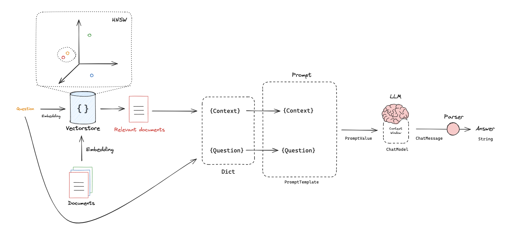

# Aleph Alpha AI Solutions Engineer Case Study Solution


## Overview
This repository is developed as part of the case study for the AI Solutions Engineer position at Aleph Alpha. The challenge involves building a tool to assist IT helpdesk agents by leveraging historical data of previously resolved tickets to suggest resolutions for new tickets.


## Problem Statement
IT helpdesk agents frequently encounter redundant issues that have been resolved previously but lack an efficient way to reference these solutions. The main problem is the lack of a system to inform the agent if and how a problem has been resolved in the past. This results in inefficiency and increased resolution times for customer tickets.

## Approach
The solution involves creating an intelligent ticket resolution assistant that:
1. **Indexes Existing Tickets**: Uses embeddings to transform previous tickets into a searchable format stored in a Chroma database.
2. **Queries for Solutions**: When a new ticket arrives, the system queries this database to find similar past tickets and suggests possible solutions.
3. **Leverages Advanced AI Models**: Integrates Meta-Llama, a generative model, to suggest solutions when direct matches are not found in the database.

### Key Components
- **Data Processing**: Consolidates and preprocesses ticket data from various formats into a unified DataFrame.
- **Embedding Utilities**: Employs sentence transformer models to generate embeddings for each ticket, which are then indexed using the Chroma database for quick retrieval.
- **Response Generation**: Implements two modes of operation:
  - Direct response from the database using vector similarity to find and suggest solutions from past tickets.
  - Generative response using the Meta-Llama model to generate insights and solutions based on the context of the query.

## Features
- **Dual Mode Response System**:
  - **Mode 1**: Directly fetches solutions from past resolved tickets.
  - **Mode 2**: Utilizes AI to generate responses for complex issues not directly resolved in past tickets.
- **Interactive UI**: Built with Streamlit, the UI allows agents to input new tickets and receive instant solution suggestions.

## Setup
### Prerequisites
- Python 3.8+
- Dependencies include pandas, requests, transformers, chromadb, langchain_community

### Installation
Clone the repository and install the required packages:
```bash
git clone https://github.com/yourusername/aa-case-study-ai-solutions-engineer-main.git
cd aa-case-study-ai-solutions-engineer-main
sh setup.sh
```

### Configuration
Set up necessary configurations in `config.py`, replacing `Your_huggingface_token` with your actual API token.

## Usage
Run the application:
```bash
streamlit run app.py
``` 
Follow the on-screen instructions to process new tickets in either direct query mode or generative response mode.

### Resources

- https://huggingface.co/sentence-transformers/all-MiniLM-L6-v2
- https://python.langchain.com/docs/integrations/llms/textgen/
- https://python.langchain.com/docs/integrations/providers/huggingface/
- https://github.com/langchain-ai/rag-from-scratch/blob/main/rag_from_scratch_1_to_4.ipynb

### Acknowledgments
- Thanks to Aleph Alpha for providing the opportunity to engage in this case study.
- Special thanks to the open-source community for the tools and libraries utilized in this project.

